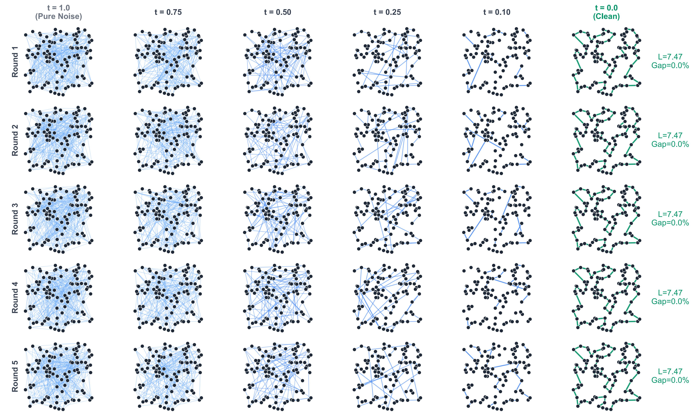

# EDISCO: Equivariant Continuous-Time Diffusion for Combinatorial Optimization

**Anonymous Implementation for ICML 2026 Submission**

This repository contains the implementation of EDISCO, an equivariant continuous-time diffusion model for solving geometric combinatorial optimization problems.

## Visualization



## Setup

```bash
conda env create -f environment.yml
conda activate edisco
```

EDISCO requires the Cython package for merging the diffusion heatmaps:

```bash
cd edisco/utils/cython_merge
python setup.py build_ext --inplace
cd -
```

## Data

Please refer to the `data` folder.

## Reproduction

Please take a look at the [reproducing_scripts](reproducing_scripts.md) for details.
