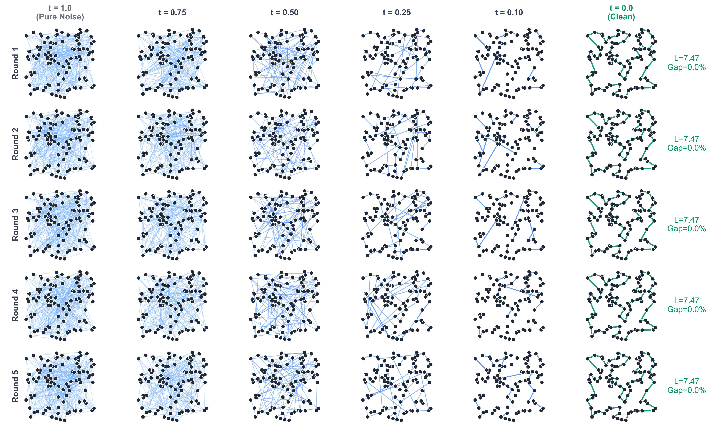

# EDISCO: Equivariant Discrete Diffusion for Euclidean Combinatorial Optimization

Official implementation of the NeurIPS 2026 paper
**"EDISCO: Equivariant Discrete Diffusion for Euclidean Combinatorial Optimization"**
by Ruogu Chen and Jie Han (University of Alberta).

EDISCO is a discrete diffusion model for Euclidean combinatorial optimization
whose generative distribution over node-index solutions is exactly
E(2)-invariant by construction. Rotating, reflecting or translating an instance
does not change the distribution of tours or routes the model produces.



*Reverse diffusion on one TSP instance: five independent sampling rounds from
uniform noise (t = 1) to the clean edge state (t = 0).*

## Method

EDISCO composes three components, each of which reads the coordinates only
through E(2)-invariant quantities or transforms equivariantly with them:

- **E(2)-equivariant score network.** An EGNN over node coordinates and noisy
  edge states. Messages, edge states and node states are invariant scalars;
  coordinates are updated equivariantly. The edge logits are E(2)-invariant.
- **Categorical continuous-time Markov chain.** Binary edge variables are
  diffused with the rate matrix `Q(t) = beta(t) (11^T - 2I)`. The network
  predicts the clean state and is trained with a `(1 - sqrt(t))`-weighted
  cross-entropy. Sampling draws from the exact posterior of the chain with
  multi-step solvers (DEIS-2, PNDM, ...), so a few steps suffice.
- **Native Edge Expansion (NEE) decoding.** A single feasibility projection of
  the final edge probabilities that ranks edges by
  `(P_ij + P_ji) / (2 (d_ij + eps))` and enforces the degree, subtour and
  (for CVRP) capacity constraints.

The same engine covers the TSP (50 to 10,000 nodes, k-nearest-neighbour graphs
above 100 nodes), capacity-conditioned CVRP (50 to 500 customers end to end,
1,000 and 2,000 customers with partition diffusion), the Euclidean Steiner tree
problem and, with a non-equivariant backbone, the maximum independent set
problem.

## Repository structure

```
edisco/
  train.py                     training and evaluation entry point
  pl_meta_model.py             base Lightning module: forward process, solver, optimizer, data loading
  pl_tsp_model.py              TSP
  pl_cvrp_model.py             CVRP with capacity conditioning
  pl_cvrp_partition_model.py   partition diffusion for large-scale CVRP
  pl_steiner_model.py          Euclidean Steiner tree
  pl_mis_model.py              maximum independent set
  diffusion/
    beta_schedules.py          noise-rate schedules beta(t)
    categorical_diffusion.py   forward CTMC kernel and training objective
    exact_ctmc.py              exact posterior q(X_s | X_t, x0)
    solvers.py                 reverse-time solvers (Euler, DDIM, DEIS-2, PNDM, DPM-2, Heun, RK4)
  models/
    egnn_encoder.py            E(2)-equivariant score network (dense and sparse)
    egnn_encoder_cvrp.py       capacity-conditioned encoder with FiLM modulation
    gnn_encoder.py             non-equivariant GNN (MIS and encoder ablation)
  co_datasets/                 dataset classes for TSP, CVRP, Steiner tree and MIS
  utils/                       decoders (NEE, CVRP edge expansion, Steiner tree, MIS), partition
                               projection, evaluation, E(2) transformations
data/                          data generation and conversion scripts, see data/README.md
tests/                         unit tests
reproducing_scripts.md         commands for every experiment of the paper
```

## Installation

```bash
git clone https://github.com/ValleyC/EDISCO.git
cd EDISCO
conda env create -f environment.yml
conda activate edisco
```

The environment pins Python 3.7, PyTorch 1.11 (CUDA 11.3), PyTorch Lightning
1.7.7 and PyTorch Geometric 2.2. Label generation additionally uses external
solvers, none of which is needed to train on the public datasets or to
evaluate: [LKH-3](http://webhotel4.ruc.dk/~keld/research/LKH-3/) and
[Concorde](https://github.com/jvkersch/pyconcorde) for the TSP,
[HGS-CVRP](https://github.com/vidalt/HGS-CVRP) (installed with the environment
through `hygese`) for CVRP, [GeoSteiner](http://www.geosteiner.com/) for exact
Steiner trees and [KaMIS](https://github.com/KarlsruheMIS/KaMIS) for MIS.

## Data

[data/README.md](data/README.md) lists the public datasets used for training
and evaluation, the commands that generate the remaining ones, and the file
formats.

## Usage

Train a TSP-50 model and evaluate it with the 5-step DEIS-2 solver and NEE
decoding:

```bash
python -u edisco/train.py \
  --task tsp \
  --do_train \
  --storage_path /your/storage/path \
  --training_split data/tsp/train/tsp50_train_concorde_500k.txt \
  --validation_split data/tsp/valid/tsp50_valid_concorde_1280.txt \
  --test_split data/tsp/test/tsp50_test_concorde.txt \
  --batch_size 64 --num_epochs 100 \
  --solver_type pndm --solver_steps 50
```

```bash
python -u edisco/train.py \
  --task tsp \
  --do_test \
  --storage_path /your/storage/path \
  --validation_split data/tsp/valid/tsp50_valid_concorde_1280.txt \
  --test_split data/tsp/test/tsp50_test_concorde.txt \
  --solver_type deis --solver_steps 5 --decoder nee \
  --ckpt_path /your/tsp50_best.ckpt --resume_weight_only
```

The remaining options take the values used in the paper by default (12-layer
EGNN with hidden dimension 256, AdamW with learning rate `2e-4`, weight decay
`1e-5`, cosine schedule and unit gradient clipping, linear `beta(t)` from 0.1
to 1.5). Checkpoints are written to `<storage_path>/models`, and the path of
the checkpoint with the best validation cost is recorded in
`checkpoints/best_checkpoint.txt`. Run `python edisco/train.py --help` for all
options.

## Reproducing the paper

[reproducing_scripts.md](reproducing_scripts.md) gives the training and
evaluation command of every experiment: TSP-50 to TSP-10000 with curriculum
training, cross-distribution and TSPLIB transfer, CVRP-50 to CVRP-500, the
capacity-shift study, partition diffusion for CVRP-1000 / 2000, the Euclidean
Steiner tree problem, MIS, and the solver, noise-schedule, architecture,
training-data and equivariance ablations.

## Tests

```bash
python -m pytest tests -q
```

The tests check the forward kernel and training objective against their closed
forms, the exact posterior against enumeration, E(2)-invariance of the network
outputs and decoders, feasibility of all decoders and the model sizes.

## Citation

```bibtex
@inproceedings{chen2026edisco,
  title     = {{EDISCO}: Equivariant Discrete Diffusion for Euclidean Combinatorial Optimization},
  author    = {Chen, Ruogu and Han, Jie},
  booktitle = {Advances in Neural Information Processing Systems},
  year      = {2026}
}
```

## License

This project is released under the [MIT License](LICENSE).

## Acknowledgements

The training framework and the non-equivariant GNN build on
[DIFUSCO](https://github.com/Edward-Sun/DIFUSCO). MIS graph generation uses the
[MIS benchmark framework](https://github.com/MaxiBoether/mis-benchmark-framework).
Public training and test sets come from
[learning-tsp](https://github.com/chaitjo/learning-tsp) and
[ML4CO-Bench-101](https://huggingface.co/datasets/ML4CO/ML4CO-Bench-101-SL).
